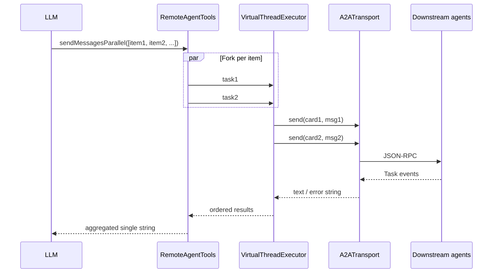

# host-agent 병렬 배치 툴 설계

## 문서 정보

| 항목 | 내용 |
|------|------|
| 대상 모듈 | `samples/host-agent` |
| 관련 컴포넌트 | `RemoteAgentTools`, `DefaultInvocationService`, `A2ATransport` |
| Spring AI 버전 | 1.1.3 (루트 `build.gradle.kts` 기준) |
| 구현 설계 | [implementation-design-host-agent-parallel-batch-tool.md](./implementation-design-host-agent-parallel-batch-tool.md) |

## 1. 배경 및 문제

### 1.1 현재 동작

- 호스트는 `ChatClient` + `@Tool`로 다운스트림 A2A 에이전트를 호출한다.
- `RemoteAgentTools#sendMessage`가 단일 툴로 위임을 수행한다.
- Spring AI `DefaultToolCallingManager`는 한 번의 어시스턴트 응답에 포함된 **여러 툴 호출을 순차(for 루프)로 실행**한다.

### 1.2 기대 효과

- 사용자 질의가 **서로 독립적인** 주문·배송·결제 조회 등으로 쪼개질 때, **동일 LLM 턴 안에서** 다운스트림 호출을 병렬로 수행해 지연을 줄인다.
- 프레임워크 내부(`ToolCallingManager`)를 포크하지 않고, **애플리케이션 경계에서 병렬화**한다.

## 2. 목표 및 비목표

### 2.1 목표

- **새 툴**을 추가하여, **여러 `(agentName, task)` 위임을 한 번의 툴 호출로** 받고 내부에서 **병렬로** `A2ATransport.send`를 실행한다.
- 결과를 **입력 순서대로** 정리된 **단일 문자열**로 반환하여 LLM이 최종 사용자 응답을 합성하기 쉽게 한다.
- 기존 `sendMessage`는 유지하여 단일 위임·순차 시나리오와 호환한다.

### 2.2 비목표

- Spring AI 기본 `ToolCallingManager`의 병렬 실행을 대체하거나 커스텀 빈으로 전역 교체하지 않는다.
- 다운스트림 에이전트 프로토콜(A2A) 자체를 변경하지 않는다.
- **에이전트 간 의존(파이프라인)** 을 한 툴 안에서 자동 오케스트레이션하지 않는다. (순차는 기존 `sendMessage` + 다중 라운드에 맡긴다.)

## 3. 이해관계자 및 사용 시나리오

### 3.1 이해관계자

- **런타임 호출자**: Amazon Bedrock AgentCore Runtime → `POST /invocations` → `DefaultInvocationService`.
- **오케스트레이터 LLM**: Bedrock Converse 기반 `ChatClient`.
- **다운스트림**: `order-agent`, `delivery-agent`, `payment-agent` 등 A2A 서버.

### 3.2 시나리오

| ID | 설명 | 권장 툴 |
|----|------|---------|
| S1 | “주문 목록과 결제 상태를 각각 물어봐도 된다”처럼 **독립** 정보 요청 | 배치 병렬 툴 |
| S2 | 단일 에이전트만 필요 | `sendMessage` |
| S3 | A 결과를 바탕으로 B를 호출해야 함 | `sendMessage`를 **순차**(여러 모델 라운드)로 사용 |

## 4. 설계 개요



핵심: **병렬화는 툴 메서드 내부**에서만 일어나며, `ChatClient`의 툴 실행 순서 이슈를 우회한다.

## 5. API 설계

### 5.1 툴 메서드 (제안명)

- **메서드명**: `sendMessagesParallel` (또는 `delegateToAgentsParallel`)
- **설명(한글, `@Tool`)**: 한 턴에 **서로 독립적인** 여러 원격 에이전트 위임을 묶어 실행한다. 에이전트 간에 입력·출력 의존이 있으면 사용하지 말고 `sendMessage`를 순차로 사용할 것.

### 5.2 입력 모델

각 항목:

| 필드 | 타입 | 의미 |
|------|------|------|
| `agentName` | `String` | 설정 키 또는 카드 `name`과 일치하는 에이전트 식별자 (기존 `sendMessage`와 동일) |
| `task` | `String` | 해당 에이전트에 넘길 작업·컨텍스트 (기존 `sendMessage`와 동일) |

**스키마 전달 방식 (구현 시 택일 또는 병행)**:

1. **권장**: `List<AgentDelegationRequest>` + Spring AI `JsonSchemaGenerator` 기반 스키마. 메서드의 `items`에는 `@ToolParam`으로 **목록**을 설명하고, `AgentDelegationRequest`의 **각 필드(레코드 컴포넌트)에도 `@ToolParam`** 으로 설명을 붙여 모델이 인자를 맞추기 쉽게 한다([Tool parameters](https://docs.spring.io/spring-ai/reference/api/tools)).
2. **대안**: 단일 `String` JSON 배열 + Gson 파싱 — 모델이 배열 인자를 약할 때 `@ToolParam`에 예시 JSON을 명시.

### 5.3 제한 (샘플)

- **샘플**에서는 한 호출당 위임 개수 **상한을 두지 않는다**. 프로덕션에서는 동시성·다운스트림 용량에 맞게 상한을 두는 것을 권장한다.
- 빈 리스트: 구현에 따라 빈 집계 문자열 또는 안내 메시지.

### 5.4 출력 포맷

모델이 스캔하기 쉬운 **고정 구획 문자열** (입력 인덱스 순서 유지):

```text
[1] agent: <name>
response:
<body>

[2] agent: <name>
response:
<body>
```

- `A2ATransport.send`가 이미 예외·실패 시 사람이 읽을 수 있는 문자열을 반환하므로, 해당 문자열을 그대로 `response:` 아래에 넣는다.
- 필요 시 `status: ok | error` 줄을 추가할 수 있으나 필수는 아님.

## 6. 동시성 및 스레딩

- JDK toolchain: 프로젝트 서브모듈 **Java 25**.
- 실행기: **`Executors.newVirtualThreadPerTaskExecutor()`** 로 I/O 블로킹(`send` 대기) 병렬화.
- 각 작업: 기존 `findByName` → `A2A.toUserMessage(task)` → `A2ATransport.send(agentCard, message)` 재사용.
- `LazyAgentCard` / `ConcurrentHashMap` 기반 맵은 여러 virtual thread에서 동시 조회·지연 로드가 가능하다.

## 7. 오류 및 일관성 정책

| 정책 | 선택 |
|------|------|
| 항목 간 실패 격리 | **수집형(collect-all)**: 한 항목 실패가 나머지 취소로 이어지지 않음 |
| 알 수 없는 에이전트 | 기존 `sendMessage`와 동일하게 “사용 가능한 에이전트” 안내 문자열을 해당 슬롯에 기록 |
| 순서 | **요청 리스트 순서 = 출력 블록 순서** (완료 시각과 무관) |

## 8. 시스템 프롬프트 변경 (`DefaultInvocationService`)

`ROUTING_SYSTEM_PROMPT`에 다음을 반영한다.

- **독립** 다중 위임은 `sendMessagesParallel`로 **한 번에** 제출한다.
- **의존**(앞 에이전트 결과가 뒤 호출에 필요)이 있으면 **`sendMessage`를 순차·다중 라운드**로 사용한다.
- 기존 지침(도구 의존, 컨텍스트 보강, 언어 등)과 모순되지 않게 짧게 추가한다.

## 9. 보안·운영 고려

- 프로덕션에서는 필요 시 배치 크기 상한·레이트 리밋으로 **과도한 동시 외부 호출**을 완화한다.
- 로깅: 배치 크기, 에이전트 이름 목록(민감 정보는 `task` 전문 로그는 DEBUG 이하 또는 생략 권장).
- 타임아웃: `A2ATransport.send`의 기존 타임아웃(현재 60초)을 그대로 따른다; 배치 전체 최악 지연은 대략 “가장 느린 단일 호출”에 수렴한다.

## 10. 테스트 전략

| 범위 | 내용 |
|------|------|
| 단위 | 항목 2개 중 1개 `findByName` 실패 → 두 블록 모두 출력에 존재 |
| 단위 | 빈 목록·null 등 경계 조건(구현 정책에 맞게) |
| 통합 | 선택: 실제 에이전트 없이 `A2ATransport` 또는 카드 조회를 테스트 더블로 대체 |

## 11. 구현 체크리스트

- [ ] `RemoteAgentTools`에 입력 record 및 `sendMessagesParallel` 추가
- [ ] virtual thread executor로 병렬 실행 + 순서 보존 집계
- [ ] `DefaultInvocationService` 시스템 프롬프트 문단 추가
- [ ] 단위 테스트 (호스트 모듈)
- [ ] `CLAUDE.md` 또는 README에 “병렬 배치 툴” 한 단락 링크(선택)

### 11.1 문서·Javadoc 규칙

- 구현 세부는 [implementation-design-host-agent-parallel-batch-tool.md](./implementation-design-host-agent-parallel-batch-tool.md)를 따른다.
- **`/** ... */` Javadoc은 모두 영어**로 작성한다. `@Tool` / `@ToolParam` 설명 문자열은 모델용이므로 기존과 같이 한국어 유지를 기본으로 한다.

## 12. 향후 과제

- Spring AI에서 `DefaultToolCallingManager` 수준 **공식 병렬 툴 실행**이 들어오면, 본 툴과의 역할 중복을 검토한다.
- 필요 시 배치 결과를 구조화(JSON)해 파싱 비용을 줄이는 변형을 평가한다.

## 13. 참고

- Spring AI `DefaultToolCallingManager` (v1.1.3): `getToolCalls()` 순차 실행
- 프로젝트 규칙: `CLAUDE.md` — 툴 순차 실행, `A2ATransport` 동기 블로킹
